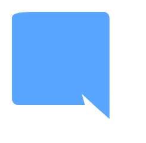

  

  

  
  &nbsp;&nbsp;&nbsp;
  

  

  <code>
    Autodidact developer focused on logic, performance and structure. 
    From scripting to low-level programming. 
    Build. Break. Learn. Refine.
  </code>

  

  
  &nbsp;&nbsp;&nbsp;
  

  

  <em>
    “Code should be simple to read, 
    hard to break.”
  </em>

  

